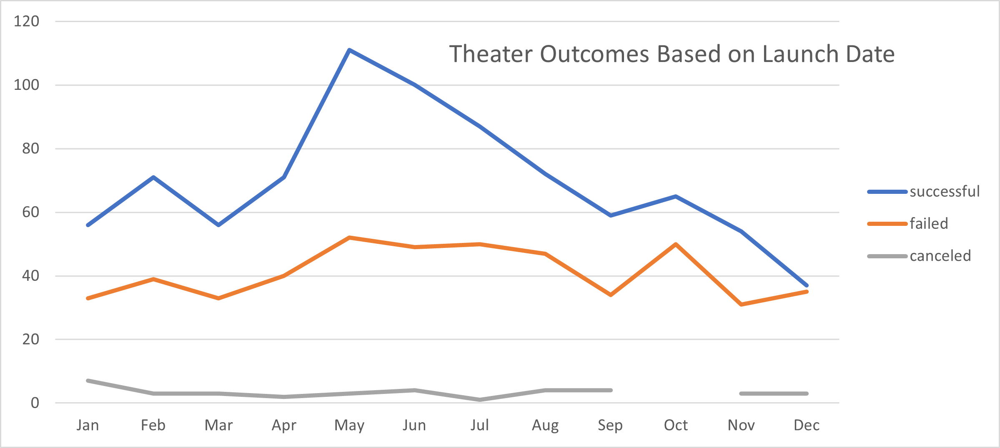
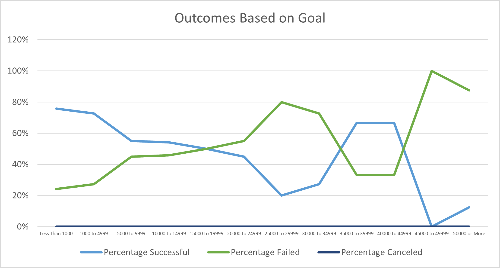

# Kickstarting with Excel

## Overview of Project

Louise needs to make sure that her play *Fever* will make the goal in time for her launch date. By analyzing past plays similar to her own, she can get a better idea of the outcome.  

### Purpose

The purpose of this analysis was to determine whether Louise's play will reach the goal amount before the launch date. We analyzed both successful, failed, and canceled theater productions based on the launch date and the total number of projects that were successful, failed and canceled based on the goal.

## Analysis and Challenges

Analysis was done using Microsoft Excel. No challenges were faced in the analysis but a challenge could arise with the COUNTIFS() function. Each parameter <1000, 1000-4999, 5000-9999, etc. had to be input into the function manually.  With the number of goal parts already high, any more would make this task very tedious.  Separating the goal and using individual cells may have made this task easier and allowed for less manual errors to occur.

### Analysis of Outcomes Based on Launch Date

The outcome of theater productions was mainly succesful more than a failure in pretty much every occurance.  The only time where success and failure are almost the same is in December. The main takeaway would be to have the theater production during the months of April - August.

### Analysis of Outcomes Based on Goals

A majority of the plays that were successful had a goal of less than $5000. Anything higher than $5000 and the success of the play outcome goes down.  No plays were canceled, no matter what goal was there.

### Challenges and Difficulties Encountered

No challenges or difficulties came from this analysis.

## Results

- What are two conclusions you can draw about the Outcomes based on Launch Date?
1. The worst time of the year to launch a theater production is the winter months (October-December)
2. The best time of the year to launch a theater production is in the summer months (April-August)

- What can you conclude about the Outcomes based on Goals?
  - Keeping a goal under $5000 will greatly increase the likelyhood of accomplishing the goal.

- What are some limitations of this dataset?
  - The limitations of this dataset are the lack of number of backers and what the average backing amount was.  These are within the dataset but not used in our analysis at all.

- What are some other possible tables and/or graphs that we could create?
  - Looking at the backers and the amount that was pledged for these plays would be something that could help Louise with her understanding of whether or not her production will be successful by launch date.
